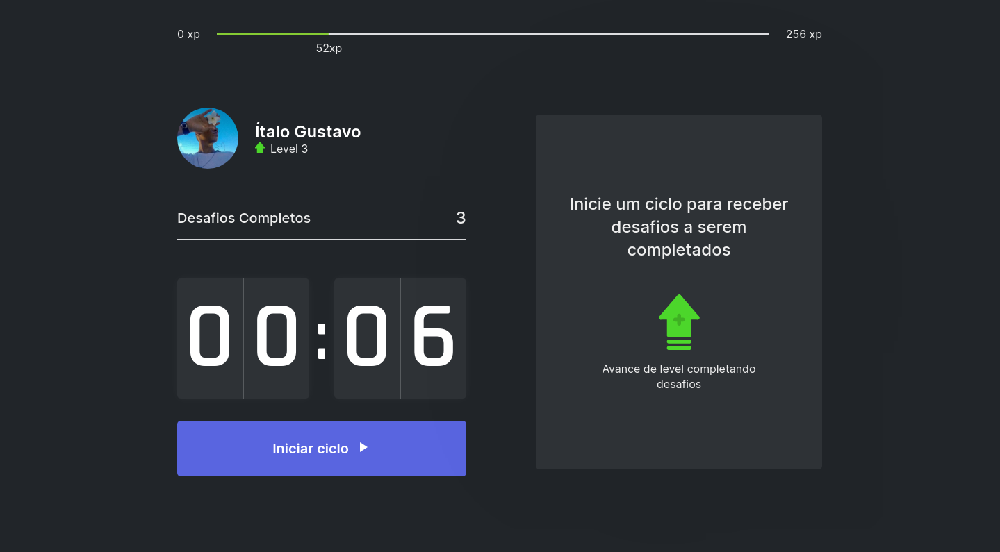

<h1 align="center"> 
    
</h1>

<p align="center">
    <a href="#-projeto">🖥 Projeto</a>&nbsp;&nbsp;&nbsp;|&nbsp;&nbsp;&nbsp;
    <a href="#-tecnologias">👨‍💻 Tecnologias</a>&nbsp;&nbsp;&nbsp;|&nbsp;&nbsp;&nbsp;
    <a href="#-executar-o-projeto">🖇 Execução do Projeto</a>&nbsp;&nbsp;&nbsp;|&nbsp;&nbsp;&nbsp;
    <a href="#-layout">🎨 Layout</a>&nbsp;&nbsp;&nbsp;|&nbsp;&nbsp;&nbsp;
    <a href="#-licença">📃 Licença</a>&nbsp;&nbsp;&nbsp;|&nbsp;&nbsp;&nbsp;
    <a href="#-observações">📌 Observações</a>
</p>

<h1 style="display: flex; flex-direction: row" align="center">
    
    
</h1>

<h4 align="center"> 
	🚧 move.it | Em desenvolvimento... 🚧    
</h4>

## 🖥 Projeto
O move.it é um projeto que aplica a técnica de pomodoro, junto a um sistema desafios, que se baseiam em na realização de pequenos exrcícios físicos, para um descanso de pessoas que passam muito tempo sentadas.

## 👨‍💻 Tecnologias
As tecnologias usadas nesse projeto foram:
- [React](https://reactjs.org)
- [Next.js](https://nextjs.org/)
- [TypeScript](https://www.typescriptlang.org/)
- [Yarn](https://yarnpkg.com/)
- [Node.js](https://nodejs.org/en/)

## 🖇 Executar o Projeto
Para executar o projeto, siga os seguintes passos:
- Primeiro verifique se você possui o yarn e node. Caso não possua, instale antes de prosseguir

- Clone o repositório
    ```bash
    $ git clone https://github.com/Yta-ux/move.it.git
    ```
- Instale as dependências
    ```bash
        $ yarn
     ```
- Acesse o [localhost:3000](http://localhost:3000)

## 🎨 Layout
Os layouts usados no projeto foram:
- [Layout Princiapal](https://www.figma.com/file/ge20pu3ofMOKoliUyKx1Nl/Move.it-1.0)
- [Layout do tema dark](https://www.figma.com/file/mqqwYS7zVEa9NlVX0NChJ2/Move.it-Dark-Theme?node-id=160%3A2761)
- Para acessar os layouts, é necessário ter uma conta no [Figma](http://figma.com/).


##  📃 Licença
Esse projeto possui licença MIT. Para mais detalhes consulte o arquivo [LICENSE](LICENSE.md)

## 📌 Observações
Esse projeto foi desenvolvido com o apoio da RocketSeat, por meio do evento Next Level Week, que se encontra na 4º Edição 
